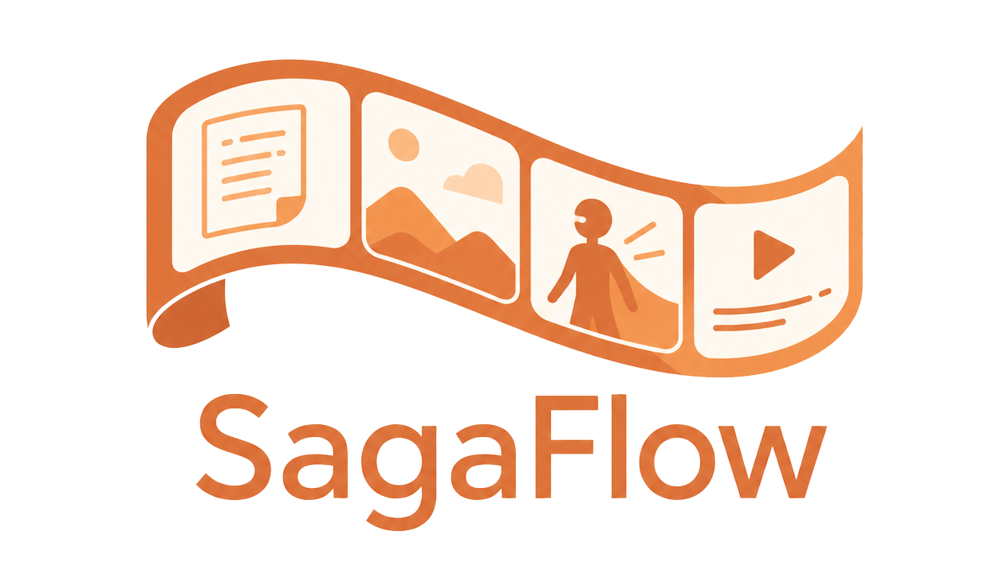

<p align="center">
  
</p>

<p align="center">
  本地优先的 AI 漫剧生产工作台：在一个应用里管理剧本、素材、模型生成、分镜画布与媒体处理。
</p>

<p align="center">
  <a href="https://go.dev/"></a>
  <a href="https://react.dev/"></a>
  <a href="LICENSE"></a>
</p>

SagaFlow 面向希望在自己的电脑、NAS 或小型服务器上完成 AI 漫剧生产的个人创作者。应用由单个 Go 进程提供 API、任务执行和内嵌的 React 工作台，默认只依赖 SQLite 与本地文件系统，不需要 PostgreSQL、Redis、独立 Worker 或强制 S3。

桌面用户还可以使用独立的 Fyne 启动器管理内核进程。启动器只负责启动、
状态、托盘和本机维护；项目、模型与媒体操作仍由浏览器工作台统一提供。
服务器和 Docker 部署只运行 `sagaflow` 内核，不携带任何图形依赖。

> 当前处于积极开发阶段，功能已经形成完整生产闭环，但数据结构和交互仍可能在正式版本前调整。

## 核心能力

- **项目与剧本**：管理项目、分集和 Markdown 剧本版本。
- **树状资产库**：人物、场景、道具和素材支持任意层级分组；文本、图像、音频和视频统一管理。
- **多模型生成**：接入 DeepSeek、火山方舟、MiniMax、阿里云百炼、硅基流动、智谱、腾讯云 Token Hub、Kimi / Moonshot、Ollama 与 ComfyUI。
- **可更新模型目录**：内置模型清单随应用发布，也可以在界面导入独立 JSON 更新包。
- **分集画布**：将已采用资产、备注、关系线和视频分镜放到无限画布中编排。
- **本地媒体工具**：检查、转码、音频处理、裁切、合片和视频截图。
- **本地优先存储**：生成结果先落到本地对象库；S3 只作为用户主动发布的可选公网副本。
- **持久任务队列**：生成和媒体任务都写入 SQLite，应用重启后仍可恢复状态。
- **完整备份**：一次归档数据库、素材对象和凭证主密钥。

## 为什么是本地优先

```text
浏览器工作台
    │
    ▼
SagaFlow 单二进制
    ├── SQLite：项目、任务、模型与业务数据
    ├── data/objects：本地素材主副本
    ├── 模型网关：云端模型、Ollama、ComfyUI
    ├── 本地媒体引擎：截图、转码、裁切与合片
    └── 可选 S3：仅手动发布公网副本
```

本地文件始终是主副本。Ollama、ComfyUI 和媒体工具直接读取本地素材；只有需要公网 URL 的云端模型，才需要先把指定素材手动发布到 S3。

## 快速开始

### 从源码构建

需要 Go 1.26、Node.js 24 和 Corepack。媒体组件不是构建依赖，可在运行后
通过工作台或桌面启动器按需安装。

```bash
git clone https://github.com/gofurry/sagaflow.git
cd sagaflow

cd web
corepack pnpm install --frozen-lockfile
corepack pnpm build
cd ..
```

Windows PowerShell：

```powershell
go build -ldflags="-X main.version=v0.1.0" -o .\bin\sagaflow.exe .\cmd\sagaflow
.\bin\sagaflow.exe serve
```

Linux 或 macOS：

```bash
go build -ldflags="-X main.version=v0.1.0" -o ./bin/sagaflow ./cmd/sagaflow
./bin/sagaflow serve
```

打开 [http://127.0.0.1:18848](http://127.0.0.1:18848)，首次进入时按引导创建唯一的本地账号。独立内核默认在二进制同目录创建 `data/`，便携桌面版在发行包根目录创建 `data/`；移动或备份整个目录即可带走工作台数据。

### 桌面启动器

桌面发布包的根目录只保留一个用户入口；内核放在平台约定的内部目录，
由启动器自动定位和管理：

```text
Windows/
├── SagaFlow.exe
├── runtime/sagaflow-core.exe
└── SAGAFLOW-LICENSE.txt

Linux/
├── sagaflow
├── libexec/sagaflow-core
├── share/icons/...
└── SAGAFLOW-LICENSE.txt

macOS/
├── SagaFlow.app/Contents/MacOS/SagaFlow
├── SagaFlow.app/Contents/Helpers/sagaflow-core
├── SagaFlow.app/Contents/Resources/sagaflow.icns
└── SAGAFLOW-LICENSE.txt
```

打开根目录的 `SagaFlow.exe`、`sagaflow` 或 `SagaFlow.app` 后，由用户决定何时在 `127.0.0.1:18848`
启动内核；“启动内核后自动打开工作台”可以控制健康检查通过后是否打开
浏览器。关闭窗口默认最小化到系统托盘，也可以在设置偏好中改为直接退出；
退出时，由启动器启动的
内核也会安全停止。检测到已经运行的兼容内核时只会连接，不会擅自终止
外部进程。启动器还提供数据与日志目录、系统诊断、即时备份、历史日志
清理、媒体组件安装、内置模型目录更新和厂商密钥入口。
内核日志按 10 MB 轮转，最多保留 5 份、14 天并压缩历史文件。
Windows/Linux 桌面包继续使用包内 `data/`；macOS 使用用户的
`Application Support/SagaFlow`，避免向 `.app` 应用包写入运行数据。

从源码构建启动器还需要本机 C 编译器和 Fyne 所需图形开发库：

```powershell
.\.github\workflows\scripts\build-desktop.ps1 `
  -TargetOS windows -TargetArch amd64 -OutputDirectory bin
```

桌面端使用独立 Go 模块，位于 `cmd/sagaflow-desktop`，因此 Fyne/CGo
不会进入内核的依赖图、Docker 镜像或服务器构建。

推送 `v*` 标签后，Release workflow 会自动构建并发布 Windows、Linux、
macOS 的 amd64/arm64 桌面包与独立内核包；Windows 使用 `.zip`，
Linux/macOS 使用 `.tar.gz`。GHCR 中的同版本 Docker 标签同时提供
`linux/amd64` 和 `linux/arm64`。`SHA256SUMS` 与 `model-catalog.json`
是校验和在线目录更新所需的辅助资产。

也可以提前通过命令行初始化账号：

```bash
sagaflow account init \
  --username admin \
  --display-name Creator \
  --password "change-this-password"
sagaflow serve
```

### Docker Compose

Docker 部署只需要一个应用容器和一个数据卷：

```bash
docker compose build
docker compose run --rm sagaflow account init \
  --username admin \
  --display-name Creator \
  --password "change-this-password"
docker compose up -d
```

访问 [http://localhost:18848](http://localhost:18848)。停止应用使用 `docker compose down`；除非确认要删除全部数据，否则不要添加 `-v`。

## 发布包

独立内核包保持精简：

```text
sagaflow-core-<goos>-<goarch>/
├── sagaflow[.exe]
└── SAGAFLOW-LICENSE.txt
```

第三方媒体组件不随发布包分发，可在界面按需安装；来源与许可证见
[`docs/ffmpeg.md`](docs/ffmpeg.md)。

## 数据目录

```text
data/
├── sagaflow.db       # SQLite 数据库
├── objects/          # 本地素材主副本
├── secrets/          # 本机凭证主密钥
├── temp/             # 可清理的任务临时文件
├── backups/          # 默认备份输出
├── tools/            # 可重新下载的托管工具
└── config.yaml       # 可选的最小运行配置
```

模型密钥、服务连接、工作流、Prompt 预设、音色和 S3 连接均在工作台内部维护，不需要写进仓库配置文件。

## 本地模型与云端模型

登录后进入“模型”：

- Ollama 默认连接 `http://127.0.0.1:11434`，可以同步本机已安装模型；
- ComfyUI 默认连接 `http://127.0.0.1:8188`，可以导入 API 工作流并自动解析输入参数；
- 云端服务通过“服务连接”和“凭证”配置；
- 模型目录支持按服务商、类型和参考能力过滤；
- Prompt 预设与音色是全局资源，可跨项目复用。

模型参数和平台能力会持续变化，内置目录与独立更新包的格式见 [`docs/model-catalog.md`](docs/model-catalog.md)。

## 开发

```bash
# 后端与全部 Go 测试
go test ./...
go vet ./...

# 前端开发
cd web
corepack pnpm dev

# 前端检查与生产构建
corepack pnpm lint
corepack pnpm build
```

常用 Make 目标：

```bash
make run
make test
make build
make docker-up
make docker-down
```

GitHub Actions 会在 `main`、`dev` 和 Pull Request 上执行前端 lint/构建、
Go 测试与 vet、Docker 构建，并生成 Windows、Linux、macOS 的
amd64/arm64 内核构建产物；桌面构建使用原生 Windows、Linux 和 macOS
Runner，生成三个系统的 amd64/arm64 启动器包。构建入口位于
`.github/workflows/scripts/`。

## 运维

```bash
sagaflow doctor
sagaflow account reset-password --password "new-password"
sagaflow backup create
sagaflow backup restore --archive /path/to/backup.zip --yes
```

恢复备份前必须停止 SagaFlow。备份包含素材和凭证主密钥，应像密码一样妥善保管。

更多信息：

- [架构与数据边界](docs/architecture.md)
- [部署：systemd、Docker、Windows 与 macOS](docs/deployment.md)
- [模型目录与更新包](docs/model-catalog.md)

## 参与贡献

欢迎提交 Issue 和 Pull Request。提交代码前请确保：

```bash
go test ./...
go vet ./...
cd web && corepack pnpm lint && corepack pnpm build
```

请勿提交 API Key、`.env`、本地数据库、生成素材或其他个人数据。

## 许可证

SagaFlow 源代码使用 [MIT License](LICENSE)。
