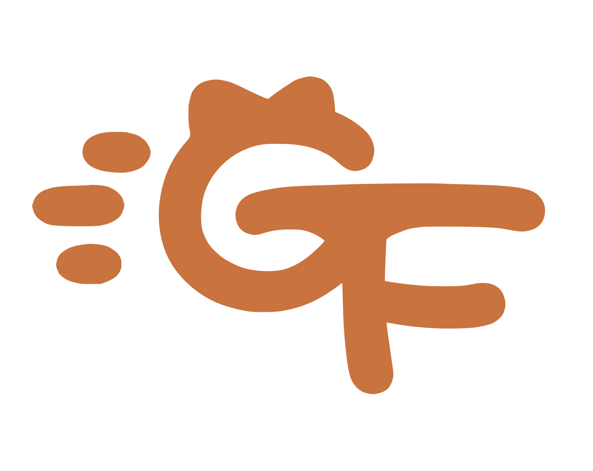

<p align="center">
  
</p>

<h1 align="center">SagaFlow</h1>

<p align="center">
  本地优先的 AI 漫剧生产工作台：在一个应用里管理剧本、素材、模型生成、分镜画布与媒体处理。
</p>

<p align="center">
  <a href="https://go.dev/"></a>
  <a href="LICENSE"></a>
  
</p>

SagaFlow 面向希望在自己的电脑、NAS 或小型服务器上完成 AI 漫剧生产的个人创作者。应用由单个 Go 进程提供 API、任务执行和内嵌的 React 工作台，默认只依赖 SQLite 与本地文件系统，不需要 PostgreSQL、Redis、独立 Worker 或强制 S3。

> 当前处于积极开发阶段，功能已经形成完整生产闭环，但数据结构和交互仍可能在正式版本前调整。

## 核心能力

- **项目与剧本**：管理项目、分集和 Markdown 剧本版本。
- **树状资产库**：人物、场景、道具和素材支持任意层级分组；文本、图像、音频和视频统一管理。
- **多模型生成**：接入 DeepSeek、火山方舟、MiniMax、阿里云百炼、硅基流动、智谱、腾讯云 Token Hub、Kimi / Moonshot、Ollama 与 ComfyUI。
- **可更新模型目录**：内置模型清单随应用发布，也可以在界面导入独立 JSON 更新包。
- **分集画布**：将已采用资产、备注、关系线和视频分镜放到无限画布中编排。
- **本地媒体工具**：检查、转码、画幅适配、音频处理、裁切、合片和视频截图。
- **本地优先存储**：生成结果先落到本地对象库；S3 只作为用户主动发布的可选公网副本。
- **持久任务队列**：生成和媒体任务都写入 SQLite，应用重启后仍可恢复状态。
- **完整备份**：一次归档数据库、素材对象和凭证主密钥。

## 为什么是本地优先

```text
浏览器工作台
    │
    ▼
SagaFlow 单二进制
    ├── SQLite：项目、任务、模型与业务数据
    ├── data/objects：本地素材主副本
    ├── 模型网关：云端模型、Ollama、ComfyUI
    ├── FFmpeg：本地媒体处理
    └── 可选 S3：仅手动发布公网副本
```

本地文件始终是主副本。Ollama、ComfyUI 和 FFmpeg 直接读取本地素材；只有需要公网 URL 的云端模型，才需要先把指定素材手动发布到 S3。

## 快速开始

### 从源码构建

需要 Go 1.26、Node.js 24、Corepack，以及与当前系统和架构匹配的
FFmpeg/FFprobe。可以把它们放在系统 `PATH`，也可以放到
`tools/ffmpeg/<goos>-<goarch>/`。

```bash
git clone https://github.com/gofurry/sagaflow.git
cd sagaflow

cd web
corepack pnpm install --frozen-lockfile
corepack pnpm build
cd ..
```

Windows PowerShell：

```powershell
.\tools\ffmpeg\install-windows.ps1
go build -o .\bin\sagaflow.exe .\cmd\sagaflow
.\bin\sagaflow.exe serve
```

Linux 或 macOS：

```bash
go build -o ./bin/sagaflow ./cmd/sagaflow
./bin/sagaflow serve
```

打开 [http://127.0.0.1:8080](http://127.0.0.1:8080)，首次进入时按引导创建唯一的本地账号。应用默认在二进制同目录创建 `data/`；移动或备份整个目录即可带走工作台数据。

也可以提前通过命令行初始化账号：

```bash
sagaflow account init \
  --username admin \
  --display-name Creator \
  --password "change-this-password"
sagaflow serve
```

### Docker Compose

Docker 镜像内已安装 FFmpeg，只需要一个应用容器和一个数据卷：

```bash
docker compose build
docker compose run --rm sagaflow account init \
  --username admin \
  --display-name Creator \
  --password "change-this-password"
docker compose up -d
```

访问 [http://localhost:8080](http://localhost:8080)。停止应用使用 `docker compose down`；除非确认要删除全部数据，否则不要添加 `-v`。

## FFmpeg 与多平台发布

FFmpeg 不内嵌到 SagaFlow 二进制，也不绑定某个操作系统或 CPU
架构。每个平台的发布包携带对应工具：

```text
sagaflow-<goos>-<goarch>/
├── sagaflow[.exe]
├── ffmpeg[.exe]
├── ffprobe[.exe]
├── SAGAFLOW-LICENSE.txt
└── FFMPEG-LICENSE.txt
```

SagaFlow 会从程序同目录、平台工具目录和系统 `PATH` 自动发现
FFmpeg。这样可以分别支持 Windows、Linux、macOS 的 amd64/arm64，
同时保持源码仓库和应用二进制与架构无关。Docker 镜像直接安装
发行版软件包。

开发环境安装、平台目录约定、发布打包脚本和第三方许可证说明见
[`tools/ffmpeg/README.md`](tools/ffmpeg/README.md)。

## 数据目录

```text
data/
├── sagaflow.db       # SQLite 数据库
├── objects/          # 本地素材主副本
├── secrets/          # 本机凭证主密钥
├── temp/             # 可清理的任务临时文件
├── backups/          # 默认备份输出
└── config.yaml       # 可选的最小运行配置
```

模型密钥、服务连接、工作流、Prompt 预设、音色和 S3 连接均在工作台内部维护，不需要写进仓库配置文件。

## 本地模型与云端模型

登录后进入“模型”：

- Ollama 默认连接 `http://127.0.0.1:11434`，可以同步本机已安装模型；
- ComfyUI 默认连接 `http://127.0.0.1:8188`，可以导入 API 工作流并自动解析输入参数；
- 云端服务通过“服务连接”和“凭证”配置；
- 模型目录支持按服务商、类型和参考能力过滤；
- Prompt 预设与音色是全局资源，可跨项目复用。

模型参数和平台能力会持续变化，内置目录与独立更新包的格式见 [`docs/model-catalog.md`](docs/model-catalog.md)。

## 开发

```bash
# 后端与全部 Go 测试
go test ./...
go vet ./...

# 前端开发
cd web
corepack pnpm dev

# 前端检查与生产构建
corepack pnpm lint
corepack pnpm build
```

常用 Make 目标：

```bash
make run
make test
make build
make docker-up
make docker-down
```

## 运维

```bash
sagaflow doctor
sagaflow account reset-password --password "new-password"
sagaflow backup create
sagaflow backup restore --archive /path/to/backup.zip --yes
```

恢复备份前必须停止 SagaFlow。备份包含素材和凭证主密钥，应像密码一样妥善保管。

更多信息：

- [架构与数据边界](docs/architecture.md)
- [部署：systemd、Docker、Windows 与 macOS](docs/deployment.md)
- [模型目录与更新包](docs/model-catalog.md)

## 参与贡献

欢迎提交 Issue 和 Pull Request。提交代码前请确保：

```bash
go test ./...
go vet ./...
cd web && corepack pnpm lint && corepack pnpm build
```

请勿提交 API Key、`.env`、本地数据库、生成素材或其他个人数据。

## 许可证

SagaFlow 源代码使用 [MIT License](LICENSE)。

发布包附带的 FFmpeg / FFprobe 是独立的第三方程序；SagaFlow
通过子进程和文件与其交互。相应许可证和分发说明保存在
[`tools/ffmpeg/README.md`](tools/ffmpeg/README.md)。
